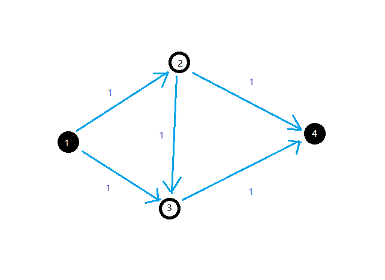
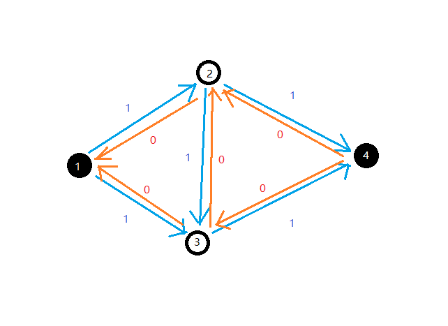
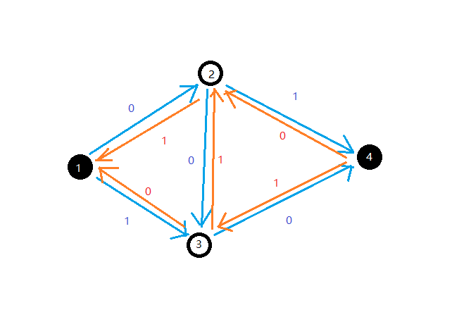
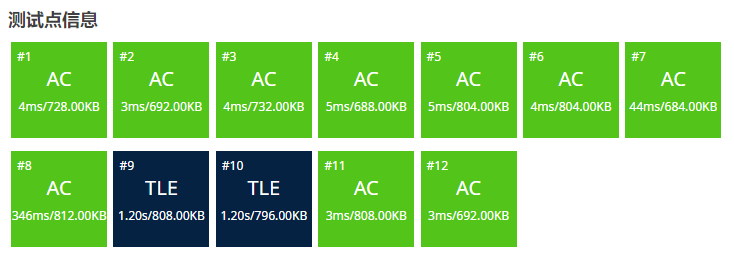
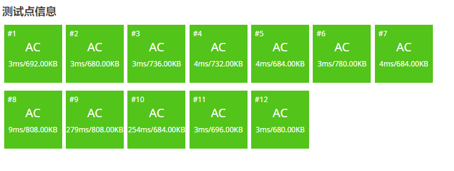
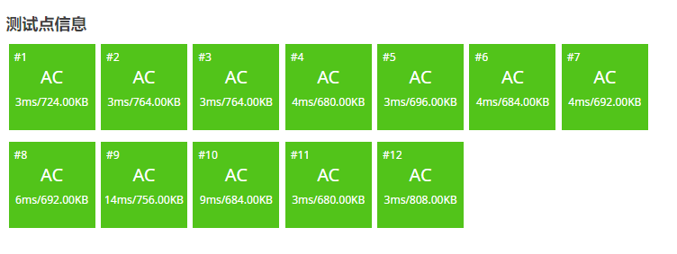

# 网络流学习笔记

## 前言

作为这个博客（时间上的）的第一个算法内容，我本来打算放一点我喜欢的（比如数论基础），但是最近教练勒令我们先自学一下网络流，那来都来了，网络流也是个很重要的内容，不如就先写这个了。

## 定义

学一个东西肯定要先了解它“是什么”，不然就会像我学 DP 一样学了两年没入门。

/// admonition | 网络流的定义
    type: quote


- **网络**的定义：

网络是指一个有向图 $G=(V,E)$。

每条边 $(u,v)\in E$ 都有一个权值 $c(u,v)$，称之为容量（Capacity），当 $(u,v)\notin E$ 时有 $c(u,v)=0$。

其中有两个特殊的点：源点（Source）$s\in V$ 和汇点（Sink）$t\in V$,($s\neq t$)。

- **流**的定义

设 $f(u,v)$ 定义在二元组 ($u\in V,v\in V$) 上的实数函数且满足

- 容量限制：对于每条边，流经该边的流量不得超过该边的容量，即，$f(u,v)\leq c(u,v)$
- 斜对称性：每条边的流量与其相反边的流量之和为 0，即 $f(u,v)=-f(v,u)$
- 流守恒性：从源点流出的流量等于汇点流入的流量，即 $\forall x\in V-\{s,t\},\sum_{(u,x)\in E}f(u,x)=\sum_{(x,v)\in E}f(x,v)$

那么 f 称为网络 G 的流函数。对于 $(u,v)\in E，f(u,v)$ 称为边的**流量**，$c(u,v)-f(u,v)$ 称为边的**剩余容量**。整个网络的流量为 $\sum_{(s,v)\in E}f(s,v)$，即 从源点发出的所有流量之和。

一般而言也可以把网络流理解为整个图的流量。而这个流量必满足上述三个性质，我们称满足这三个性质的流为可行流。

摘自 [OI Wiki](https://oi-wiki.org/graph/flow/)

///

## 网络流常见算法

常见的网络流问题有三种：最大流，最小割，费用流。但是一般都不会直接考，因为网络流的重点是建模（就是如何把一个问题转化为网络流问题），所以一般网络流题不会考你具体用哪个算法（但不排除有毒瘤出题人），通常我们三种问题各记一个算法就行了。

### 最大流

我们有一张图，要求从源点流向汇点的最大流量（可以有很多条路到达汇点），就是我们的最大流问题。

最大流是最基础的网络流问题，而解决最大流问题的入门算法有三种。

#### FF 算法

FF（Ford-Fulkerson）算法是解决最大流问题最基础的算法，其它算法基本都是以它为理论基础建立的。但它的复杂度并不优秀所以一般不掌握。

FF 算法的核心在于找增广路，何为增广路？

/// admonition | 增广路的定义
    type: quote

增广路，是从源点到汇点的路径，其上所有边的残余容量均大于 $0$。FF 算法就是不断寻找增广路，直到找不到为止。
///

什么是残余容量？首先每条边最初的残余容量就是它的容量 $c(u,v)$，然后流了一段时间后，这条边的流量为 $f(u,v)$，那么这条边的残余流量就是 $c(u,v)-f(u,v)$。通俗来讲，残余容量就是一条边还能容纳多少流量。残余容量组成的网络叫**残量网络**。

FF 算法的过程就是每次找一条增广路，然后流满这条路的流量，一直到找不到为止。

那么，这个算法一定是对的吗？ ~~明明都说了是最基础的算法怎么可能是错的。~~

确实不一定是对的。



假如我们有这么一个网络，原点 $s=1$，汇点 $t=4$，要求它的最大流。

假如我们第一次找到增广路 $1 \to 2 \to 3 \to 4$，容易发现这样就找不到第二条增广路了。但实际上这张图可以有两条增广路为 $1 \to 2 \to 4$ 和 $1 \to 3 \to 4$。

为了解决这个问题，我们引入了**反向边**，来维护一个类似于“反悔”的过程。



反向边 $(v,u)$ 的残量永远为 $f(u,v)$，即相应的正向边的流量。每次假如有流量经过反向边，那么相当于对对应正向边的流量做**撤销**操作。

比如上一张图，假如我们找到了一条流量为 $1$ 的增广路 $1 \to 2 \to 3 \to 4$，那么残量网络就会变成这样：



这时候我们就能找到另一条流量为 $1$ 的增广路 $1 \to 3 \to 2 \to 4$。

在程序眼里，我们走的两条增广路分别是 $1 \to 2 \to 3 \to 4$ 和 $1 \to 3 \to 2 \to 4$，其实我们自己分析一下会发现这样等价于走 $1 \to 2 \to 4$ 和 $1 \to 3 \to 4$，中间的 $3 \to 2$ 相当于撤销了 $2 \to 3$ 的流量。

值得一提的是，虽然在理论上反向边和正向边是不同的，实际在程序设计上它们并没有什么特别大的差异。

/// details | FF 算法参考代码
    open: False
    type: success

```cpp
struct Flow{
	struct edge{
		int v,rst,nxt;
	}e[M<<1];
	int head[N],cnte=1;// (1)!
	int n,s,t;
	int vis[N];
	void adde(int u,int v,int w){
		e[++cnte]=edge{v,w,head[u]};head[u]=cnte;
		e[++cnte]=edge{u,0,head[v]};head[v]=cnte;
	}
	int dfs(int x,int flow){
		if(x==t){// (2)!
			return flow;
		}
		vis[x]=true;
		for(int i=head[x];i;i=e[i].nxt){
			int v=e[i].v,w=e[i].rst;
			if(w>0&&!vis[v]){
				int c=dfs(v,min(flow,w));
				if(c!=-1){
					e[i].rst-=c;
					e[i^1].rst+=c;// (3)!
					return c;
				}
			}
		}
		return -1;// (4)!
	}
	i64 FF(){
		i64 ans=0,c;
		while((c=dfs(s,inf))!=-1){// (5)!
			mem(vis,0);
			ans+=c;
		}
		return ans;
	}
}mf;
```

1. `cnte` 一定要从 $1$ 开始，后面会解释（其实任何正奇数和 $-1$ 都可以，但是不能为 $0$）。
2. 如果增广路走到汇点直接返回流量。
3. 因为 `cnte` 从 $1$ 开始，又由于每条边和反向边是相邻的，所以每条边和其反向边相异或必定为 $1$。
4. 无法到达汇点，返回 $-1$。
5. 一直重复到找不到增广路为止。

///

FF 算法的复杂度上界为 $O(ef)$，其中 $e$ 为边数，$f$ 为最大流，证明显然，假设每次遍历所有边找到一条流量为 $1$ 的增广路。

在[洛谷模板题](https://www.luogu.com.cn/problem/P3376)上可以获得 $84pts$ 的高分。



#### EK 算法

EK（Edmond-Karp）算法的核心也是找最短路，只不过它是用 BFS 实现的。它可以保证每次找到的都是最短的增广路。

/// details | EK 算法参考代码
    open: False
    type: success

```cpp
queue<int> q;
int pre[N],flow[N];
int bfs(){
    mem(pre,-1);
    while(q.size()) q.pop();
    q.push(s);
    flow[s]=inf;
    while(q.size()){
        int u=q.front();q.pop();
        if(u==t) break;
        for(int i=head[u];i;i=e[i].nxt){
            int v=e[i].v,w=e[i].rst;
            if(w>0&&pre[v]==-1){// (1)!
                pre[v]=i;
                flow[v]=min(flow[u],w);
                q.push(v);
            }
        }
    }
    return pre[t]!=-1;// (2)!
}
i64 EK(){
    i64 ans=0;
    while(bfs()){
        ans+=flow[t];
        for(int i=t;i!=s;i=e[pre[i]^1].v){// (3)!
            e[pre[i]].rst-=flow[t];
            e[pre[i]^1].rst+=flow[t];
        }
    }
    return ans;
}
```

1. 假如这条边还有残量并且 $v$ 没被访问过。
2. 能否到达汇点。
3. 从汇点出发更新残量。

///

EK 算法的复杂度上限为 $O(ve^2)$，其中 $v$ 为点数。证明可以参考[这篇文章](https://www.cnblogs.com/uid001/p/10465580.html)。这个算法已经能通过洛谷模板题了。



#### dinic 算法

事实上，dinic 算法才是广大 OIer 写最大流最常用的算法，据传言提高组出题人中有一个不成文的规定：出最大流题可以卡 EK 算法，但不能卡 dinic 算法。

dinic 算法结合了 FF 算法和 EK 算法的长处，考虑在增广时先用 BFS 对网络按与源点的距离分层，再用 DFS 寻找增广路。每次找增广路时只会往层数高一级的方向找，感性理解的话，这样不兜圈子也不走回头路，就会优化时间，严谨证明可以参考 [OI Wiki](https://oi-wiki.org/graph/flow/max-flow/#dinic-%E7%AE%97%E6%B3%95)。

另外 dinic 算法有两个优化，**当前弧优化**和**多路增广**。虽然这两个优化是本质不同的，当前弧优化是保证复杂度正确的优化而多路增广只是常数优化，但是由于互联网以讹传讹通常被称作 dinic 两大优化。

/// details | dinic 算法参考代码
    open: False
    type: success
```cpp
int dpt[N],cur[N];
bool bfs(){
    while(q.size()) q.pop();
    forup(i,1,n){
        cur[i]=head[i];// (3)!
        dpt[i]=-1;
    }
    dpt[s]=0;
    q.push(s);
    while(q.size()){
        int u=q.front();q.pop();
        for(int i=head[u];i;i=e[i].nxt){
            int v=e[i].v;
            if(dpt[v]==-1&&e[i].rst){// (4)!
                dpt[v]=dpt[u]+1;
                q.push(v);	
            }
        }
    }
    return dpt[t]!=-1;
}
int dfs(int x,int flow){
    if(x==t||!flow) return flow;
    int res=0;
    for(int &i=cur[x];i;i=e[i].nxt){// (1)!
        int v=e[i].v;
        if(dpt[v]==dpt[x]+1){
            int get=dfs(v,min(flow-res,e[i].rst));
            if(get){
                res+=get;
                e[i].rst-=get;
                e[i^1].rst+=get;
                if(res==flow) break;// (2)!
            }
        }
    }
    return res;
}
i64 dinic(){
    i64 ans=0;
    while(bfs()){
        ans+=dfs(s,inf);
    }
    return ans;
}
```

1. 当前弧优化，假设（在当前分层方法下）某条边已经跑满了，那后面它必不可能成为增广路中的边，我们可以复制一份 `head` 数组（即本代码中的 `cur` 数组）来存储第一条还有残量的边。
2. 多路增广，只有在没有剩余流量时才退出，假如 $s \to u$ 还有剩余流量就继续找增广路尽可能把流量流完。
3. 注意每次循环都要更新层数和 `cur` 数组，因为在不同的残量网络上分层可能不同。
4. 如果这条边还有残量且下一个点没被访问过。

///

dinic 的复杂度上界是 $O(v^2e)$，但是据 [OI Wiki](https://oi-wiki.org/graph/flow/max-flow/#%E6%97%B6%E9%97%B4%E5%A4%8D%E6%9D%82%E5%BA%A6%E5%88%86%E6%9E%90_1) 说基本不可能卡到这个上界，在提高组范围内可以看做 $O(\text{能过})$。

在洛谷模板题上跑得飞快。



### 最小割

在最小割之前，我们先讲讲**割**的定义。

/// admonition | 割的相关概念
    type: quote

- **定义**

对于一个网络流图 $G=(V,E)$，其**割**的定义为一种**点的划分方式**：将所有的点划分为 $S$ 和 $T=V-S$ 两个集合，其中源点 $s\in S$，汇点 $t\in T$。

- 割的**容量**

我们的定义割 $(S,T)$ 的容量 $c(S,T)$ 表示所有从 $S$ 到 $T$ 的边的容量之和，即 $c(S,T)=\sum_{u\in S,v\in T,(u,v)\in E}c(u,v)$。当然我们也可以用 $c(s,t)$ 表示 $c(S,T)$。

- 最小割

最小割就是求得一个割 $(S,T)$ 使得割的容量 $c(S,T)$ 最小。

摘自 [OI Wiki](https://oi-wiki.org/graph/flow/min-cut/#%E6%A6%82%E5%BF%B5)。

///

如何求最小割呢？我们有一个非常强的定理。

#### 最大流最小割定理

这个定理的内容非常简单：最大流等于最小割。

/// details | 证明
    open: True
    type: note

形式化地，$f(s,t)_{max}=c(s,t)_min$

对于任意一个可行流 $f(s,t)$ 的割 $(S,T)$，我们可以得到：

$$f(s,t) = \sum\limits_{u\in S, v\in T,(u,v)\in E}f(u,v)-\sum\limits_{u\in T, v\in S,(u,v)\in E}f(u,v)$$

就是从 $s$ 到 $t$ 的总量等于流过去的减去流回来的。

由于可行流的性质，上面这玩意儿显然小于等于 $\sum_{u\in S,v\in T,(u,v)\in E}c(u,v)$，所以流小于等于割。

将网络跑出最大流后，可以构造出一个割：把 $s$ 能通过残量网络到的点集设为 $S$，其余设为 $T$， 作为割 $(S,T)$， 从 $S$ 到 $T$ 的边必然满流， 从 $T$ 到 $S$ 的边必然 $0$ 流， 所以这个割的容量就是最大流的流量， 而这个割显然就是最小割。

由于 $s$ 能通过残量网络到的点集为 $S$，所以 $S$ 到 $T$ 显然满流，那么 $T$ 到 $S$ 为什么必定 $0$ 流呢？（~~这不是显然吗~~）但并没有这样一个定理。我们可以用反证法，假设有一条从 $T$ 到 $S$ 的边不 $0$ 流，即 $f(u\in T,v\in S)> 0$，那么对于它的反向边 $(v,u)$，有 $f(v,u)<c(v,u)$，即 $(v,u)$ 不满流，与假设 $u \in T,v\in S$ 矛盾，故从 $T$ 到 $S$ 的边必定 $0$ 流。

///

所以求最小割也是跑一遍 dinic 就行了，甚至还能算出方案，只要遍历一下在残量网络上 $s$ 能到达的所有结点即可。